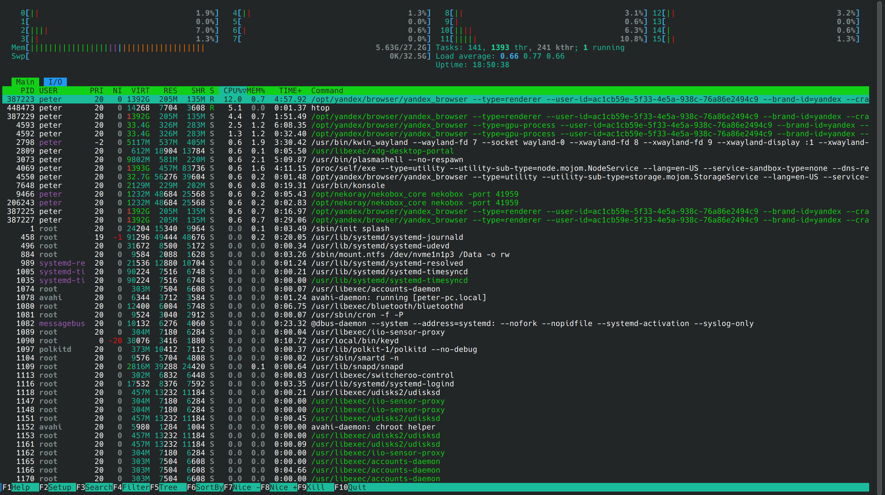

# Task 1: Key Metrics for SRE and SLAs

1) **Monitor System Resources**

1.1 `htop`:


Nice terminal process manager

1.2 `iostat`:

The `iostat` command is used for monitoring system input/output device loading by observing the time the devices are active in relation to their average transfer  rates.  The  `iostat` command generates reports that can be used to change system configuration to better balance the input/output load between physical disks.

```bash
$ iostat --human
Linux 6.11.0-14-generic (peter-pc)      12.07.2025      _x86_64_        (16 CPU)

avg-cpu:  %user   %nice %system %iowait  %steal   %idle
           0,9%    0,0%    0,6%    0,0%    0,0%   98,4%

Device             tps    kB_read/s    kB_wrtn/s    kB_dscd/s    kB_read    kB_wrtn    kB_dscd
loop0             0,00         0,0k         0,0k         0,0k     361,0k       0,0k       0,0k
loop1             0,00         0,0k         0,0k         0,0k      17,0k       0,0k       0,0k
loop10            0,02         0,7k         0,0k         0,0k      45,7M       0,0k       0,0k
loop11            0,00         0,0k         0,0k         0,0k       1,9M       0,0k       0,0k
loop12            0,00         0,0k         0,0k         0,0k       1,1M       0,0k       0,0k
loop13            0,00         0,0k         0,0k         0,0k       1,1M       0,0k       0,0k
loop14            0,00         0,0k         0,0k         0,0k       1,1M       0,0k       0,0k
loop15            0,00         0,0k         0,0k         0,0k       1,1M       0,0k       0,0k
loop16            0,00         0,0k         0,0k         0,0k       1,1M       0,0k       0,0k
loop17            0,00         0,0k         0,0k         0,0k       1,1M       0,0k       0,0k
loop18            0,00         0,0k         0,0k         0,0k     363,0k       0,0k       0,0k
loop19            0,01         0,4k         0,0k         0,0k      25,9M       0,0k       0,0k
loop2             0,00         0,0k         0,0k         0,0k     364,0k       0,0k       0,0k
loop20            0,00         0,0k         0,0k         0,0k       1,1M       0,0k       0,0k
loop21            0,07         2,4k         0,0k         0,0k     159,5M       0,0k       0,0k
loop22            0,00         0,0k         0,0k         0,0k       1,1M       0,0k       0,0k
loop3             0,00         0,0k         0,0k         0,0k     370,0k       0,0k       0,0k
loop4             0,00         0,0k         0,0k         0,0k     371,0k       0,0k       0,0k
loop5             0,00         0,0k         0,0k         0,0k       1,1M       0,0k       0,0k
loop6             0,01         0,1k         0,0k         0,0k       6,7M       0,0k       0,0k
loop7             0,01         0,1k         0,0k         0,0k       9,9M       0,0k       0,0k
loop8             0,00         0,0k         0,0k         0,0k       1,1M       0,0k       0,0k
loop9             0,00         0,0k         0,0k         0,0k       1,1M       0,0k       0,0k
nvme0n1           0,01         0,3k         0,0k         0,0k      17,8M       1,0k       0,0k
nvme1n1          10,04        49,1k        92,4k         0,0k       3,2G       6,0G       0,0k
```

Here we can see utilization on cpu in percents of time usage and write/read rates of disks and loop devices (virtual devices to use files like drives)

- Most memory-consuming is telegram, plasmashell and yandex browser
- Most CPU-consuming is yandex, htop and kwin_wayland
- Most I/O usage is nvme, loop21 and loop10


2. Disk Space Management

2.1 `du`

```bash
$ du -c -h -a
0       ./.git/branches
512     ./.git/config
512     ./.git/description
512     ./.git/HEAD
512     ./.git/hooks/applypatch-msg.sample
4,0K    ./.git/hooks/commit-msg.sample
8,0K    ./.git/hooks/fsmonitor-watchman.sample
512     ./.git/hooks/post-update.sample
512     ./.git/hooks/pre-applypatch.sample
4,0K    ./.git/hooks/pre-commit.sample
512     ./.git/hooks/pre-merge-commit.sample
4,0K    ./.git/hooks/pre-push.sample
8,0K    ./.git/hooks/pre-rebase.sample
1,0K    ./.git/hooks/pre-receive.sample
4,0K    ./.git/hooks/prepare-commit-msg.sample
4,0K    ./.git/hooks/push-to-checkout.sample
4,0K    ./.git/hooks/sendemail-validate.sample
4,0K    ./.git/hooks/update.sample
51K     ./.git/hooks
512     ./.git/info/exclude
512     ./.git/info
0       ./.git/objects/info
0       ./.git/objects/pack
0       ./.git/objects
0       ./.git/refs/heads
0       ./.git/refs/tags
0       ./.git/refs
57K     ./.git
512     ./current-state.txt
512     ./desired-state.txt
512     ./health.log
512     ./healthcheck.sh
512     ./reconcile.sh
64K     .
64K     total
```

Here we can see memory usage of current dir files

2.2 `dh`

```bash
$ sudo df -h -a 

Filesystem      Size  Used Avail Use% Mounted on
sysfs              0     0     0    - /sys
proc               0     0     0    - /proc
udev             14G     0   14G   0% /dev
devpts             0     0     0    - /dev/pts
tmpfs           2,8G  2,7M  2,8G   1% /run
/dev/nvme1n1p2  362G  211G  132G  62% /
securityfs         0     0     0    - /sys/kernel/security
tmpfs            14G  242M   14G   2% /dev/shm
cgroup2            0     0     0    - /sys/fs/cgroup
pstore             0     0     0    - /sys/fs/pstore
efivarfs        148K   68K   76K  48% /sys/firmware/efi/efivars
bpf                0     0     0    - /sys/fs/bpf
systemd-1          -     -     -    - /proc/sys/fs/binfmt_misc
hugetlbfs          0     0     0    - /dev/hugepages
tmpfs           5,0M   12K  5,0M   1% /run/lock
mqueue             0     0     0    - /dev/mqueue
none               0     0     0    - /sys/kernel/debug
tracefs            0     0     0    - /sys/kernel/tracing
tmpfs           1,0M     0  1,0M   0% /run/credentials/systemd-journald.service
tmpfs           1,0M     0  1,0M   0% /run/credentials/systemd-udev-load-credentials.service
configfs           0     0     0    - /sys/kernel/config
fusectl            0     0     0    - /sys/fs/fuse/connections
tmpfs           1,0M     0  1,0M   0% /run/credentials/systemd-tmpfiles-setup-dev-early.service
tmpfs           1,0M     0  1,0M   0% /run/credentials/systemd-tmpfiles-setup-dev.service
/dev/loop1      128K  128K     0 100% /snap/bare/5
/dev/loop0       52M   52M     0 100% /snap/cmake/1463
/dev/loop2       52M   52M     0 100% /snap/cmake/1468
/dev/loop3       64M   64M     0 100% /snap/core20/2582
/dev/loop4       64M   64M     0 100% /snap/core20/2599
/dev/loop6       74M   74M     0 100% /snap/core22/2010
/dev/loop7       67M   67M     0 100% /snap/core24/1006
/dev/loop8       67M   67M     0 100% /snap/core24/988
/dev/loop9      141M  141M     0 100% /snap/docker/3221
/dev/loop10     141M  141M     0 100% /snap/docker/3265
/dev/loop11      92M   92M     0 100% /snap/gtk-common-themes/1535
/dev/loop12     1,4G  1,4G     0 100% /snap/kf6-core24/30
/dev/loop13     1,3G  1,3G     0 100% /snap/kf6-core24/31
/dev/loop14     208M  208M     0 100% /snap/mesa-2404/495
/dev/loop15     291M  291M     0 100% /snap/mesa-2404/887
/dev/loop16     120M  120M     0 100% /snap/obsidian/45
/dev/loop17     121M  121M     0 100% /snap/obsidian/47
/dev/loop18      51M   51M     0 100% /snap/snapd/24718
/dev/loop19      50M   50M     0 100% /snap/snapd/24792
/dev/loop20     455M  455M     0 100% /snap/telegram-desktop/6691
/dev/loop21     455M  455M     0 100% /snap/telegram-desktop/6719
tmpfs           1,0M     0  1,0M   0% /run/credentials/systemd-sysctl.service
tmpfs            14G   29M   14G   1% /tmp
/dev/nvme1n1p1  511M  6,2M  505M   2% /boot/efi
/dev/nvme1n1p3  1,5T  780G  683G  54% /Data
tmpfs           1,0M     0  1,0M   0% /run/credentials/systemd-tmpfiles-setup.service
binfmt_misc        0     0     0    - /proc/sys/fs/binfmt_misc
tmpfs           1,0M     0  1,0M   0% /run/credentials/systemd-resolved.service
tmpfs           2,8G  2,7M  2,8G   1% /run/snapd/ns
nsfs               0     0     0    - /run/snapd/ns/docker.mnt
tmpfs           2,8G  240K  2,8G   1% /run/user/1000
portal          0,0K  0,0K  0,0K    - /run/user/1000/doc
nsfs               0     0     0    - /run/snapd/ns/telegram-desktop.mnt
/dev/loop22      74M   74M     0 100% /snap/core22/2045
```

Here we can observe usage of disk space in the system

3 largest files in the /var:
```bash
/var$ sudo du -hs * | sort -h | tail -n 3
1,4G    cache
9,8G    lib
24G     snap
```

# Task 2: Practical Website Monitoring Setup
